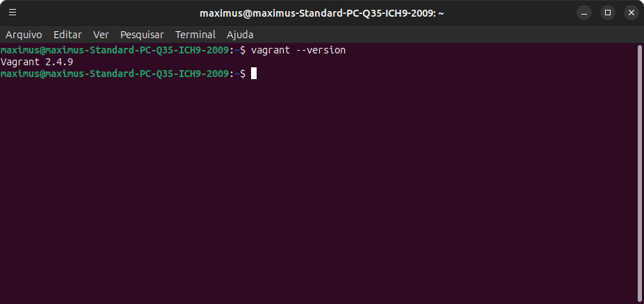
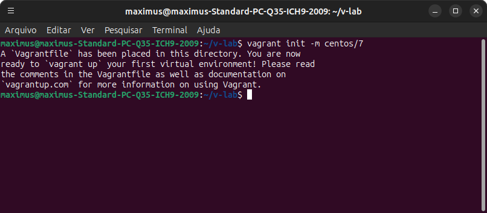
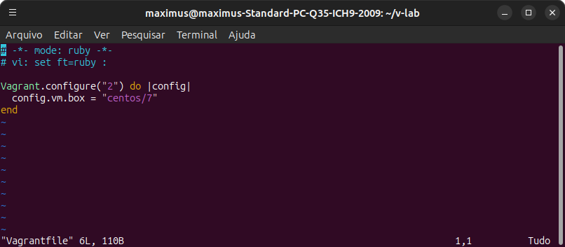
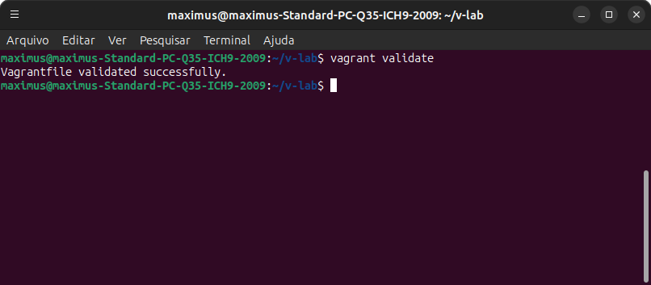
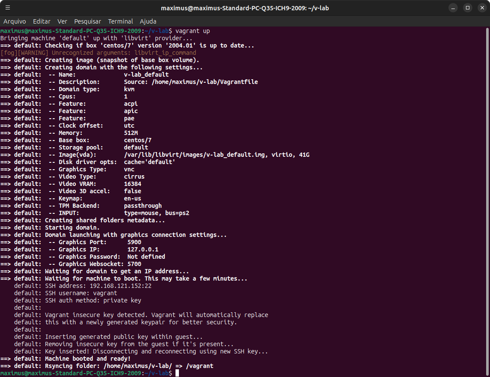
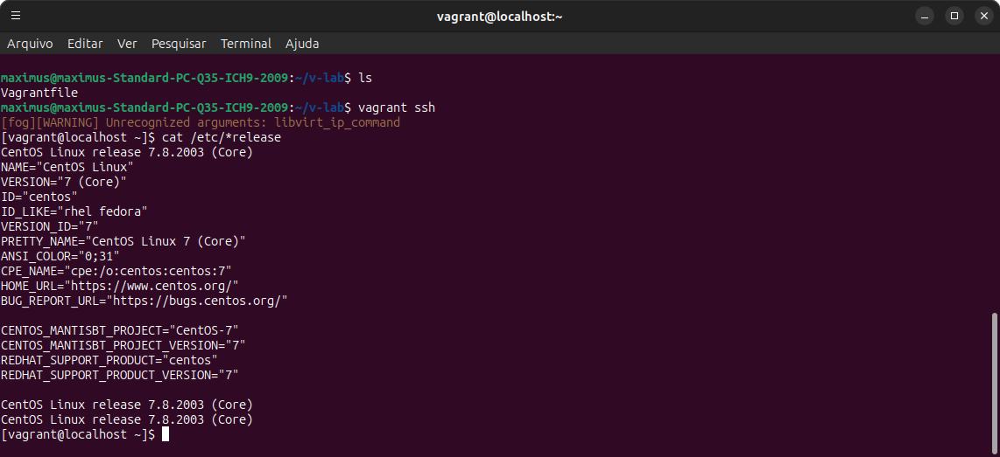

+++
date = '2025-11-12T02:39:04-03:00'
draft = false
title = 'Vagrant'
Image = "vagrant-hashicorp.png"
+++

## Desenvolvimento de ambientes virtuais com HashiCorp Vagrant

## Conceitos de Virtualização

### O que é Virtualização ?


Virtualização é o processo de criar uma versão virtual de algum recurso, por exemplo uma rede de servidores, sistemas
operacionais, dispositivos de armazenamento, etc...

## Benefícios da virtualização

### Gerenciamento de recurso

Agora podemos gerenciar o quanto de recurso computacional cada serviço irá consumir, considerando que cada máquina
virtual manterá um serviço rodando.

### Segurança

Máquinas virtuais proporcionam maior segurança devido a isolação entre elas, sua conversa com a máquina hospedeira é
apenas para operação do hardware virtual

### Automação

Atualmente existem diversas ferramentas que permitem criar infraestruturas virtualizadas em questão de segundos

## O que é o Vagrant


Vagrant é uma ferramenta de automação escrita em Ruby e mantida pela HashiCorp, a mesma empresa responsável por
outras ferramentas como o Terraform, Vault e o Nomad. Através de um script é possível subir uma infraestrutura inteira e
até mesmo configurar suas máquinas.

O Vagrant possui uma linguagem própria para os scripts baseada em Ruby e permite descrever todos os aspectos de uma
máquina virtual, como hostname, ip, cpu, memoria, disco, sistema operacional, quantidades de máquinas que serão criadas,
scripts que devem ser executados para o provisionamento, entre outros aspectos. Toda máquina criada pelo Vagrant é feita
através de uma Vagrantbox, que é uma imagem base com todos os pacotes que uma máquina virtual deve possuir quando
for criada.

## Provedor x Provisionador

O Vagrant trabalha com dois papéis distintos:

## Provedor

O provedor (provider) é o responsável pela criação da instância dos ambientes, geralmente uma máquina virtual, podendo
também ser uma instância em alguma Cloud.

## Provisionador

O provisionador (provisioner) é o responsável pelas tarefas a serem executadas de forma automatizada, como por exemplo
a instalação de pacotes e configuração do sistema.

## Fluxo de Criação de uma máquina virtual:


A construção de uma máquina virtual pelo Vagrant se inicia com o download de uma imagem base através da Vagrant Cloud,
após o download é iniciado o processo de criação e parametrização da máquina no virtualizador (hypervisor) escolhido.
Por padrão o Vagrant possúi suporte a diversos providers como Virtualbox, Docker, Hyper-V, podendo ser expansível através
de plugins a outras soluções como VMWare e AWS.

É importante que seja verificado se a imagem em questão fornece suporte ao Hypervisor escolhido. Após a criação da
máquina no Hypervisor, o processo de execução do provisionador é executado.

## Instalação do Vagrant

Antes de começar, gostaria de salientar que estarei utilizando nesse exemplo de instalação a versão do ubuntu 24.04, mas,  o processo de instalação para as demais distro é similar, de qualquer forma estou disponibilizando abaixo o link da documentação oficial do "vagrant" para que vocês possam acessar a documentação e conhecer um pouco melhor dessa ferramenta, que ao meu ver é execelente para construção de pequenos projetos. Eu utilizo muito ela na construção de meus labs, por ser uma ferramenta com curva de aprendizado relativamente simples e está alinhada com os conceitos de Devops.

 ~~**Site:**~~ [hashicorp vagrant](https://developer.hashicorp.com/vagrant)

O Processo de instalação do Vagrant é bem simples, basta baixar o instalador correspondente ao seu sistema operacional,
instalar com seu gerenciador de pacotes e então validar a Instalação.


### sh 

```sh
wget -O - https://apt.releases.hashicorp.com/gpg | sudo gpg --dearmor -o /usr/share/keyrings/hashicorp-archive-keyring.gpg
echo "deb [arch=$(dpkg --print-architecture) signed-by=/usr/share/keyrings/hashicorp-archive-keyring.gpg] https://apt.releases.hashicorp.com $(grep -oP '(?<=UBUNTU_CODENAME=).*' /etc/os-release || lsb_release -cs) main" | sudo tee /etc/apt/sources.list.d/hashicorp.list
sudo apt update && sudo apt install vagrant 
```

Valide se o processo de instalação ocorreu com sucesso:


```sh
vagrant --version
```


## Definição de Máquinas Virtuais no Vagrant

### Entendendo o Vagrantfile

Vagrantfile é o nome do arquivo que contém instruções do que o Vagrant deve fazer para criar uma máquina virtual. O
arquivo que deverá conter todas as instruções de criação de sua instância, como a quantidade de memória, cpu, rede, box,
entre outras opções.
O Vagrantfile é baseado em Ruby, e por isso segue as mesmas regras de sintaxe dessa linguagem de programação.

```ruby
Vagrant.configure("2") do |config|
   config.vm.box = "centos /7"
   config.vm.provider "virtualbox" do |vb|
     vb.memory = "1024"
     vb.cpus = "2"
  end
end
```

No exemplo acima estamos definindo uma infraestrutura de apenas uma máquina com a box do CentOS 7, a máquina terá
1024 MB de memória e 2 vCPUs.

~~*É importante que o arquivo tenha o nome de **Vagrantfile*** *(case-sensitive) ou o comando do vagrant não irá localiza-lo.
Toda estrutura de um Vagrantfile começa informando a versão que irá utilizar do configfile e termina com a palavra end.*~~

**Vagrant.configure(“2”) do |config| (...) end**

O próximo passo é informar qual a imagem que iremos utilizar nessa instância, nesse caso usaremos a imagem chamada
centos/7

**config.vm.box = “centos/7”**

Por último, criamos uma estrutura onde informamos qual é o provedor de nossa instância e suas configurações como cpu,
memória, hostname, ip, etc...

**config.vm.provider “virtualbox” do |vb|**

## Criando uma instância

Vamos criar uma instância com 1GiB de memória e 2 vCPU’s, igual ao exemplo anterior. O Vagrant permite que você gere
o arquivo utilizando o parâmetro init, porém também é possível criar o arquivo manualmente, desde que o nome seja
respeitado.

Gere o arquivo Vagrantfile com o mínimo de configuração:

```sh
vagrant init -m centos /7
```


*Ao executar o comando, um arquivo Vagrantfile é criado com diversas opções já preenchidas, porém comentadas. Para quem está
trabalhando pela primeira vez com vagrant, talvez seja a melhor opção, caso contrario use a opção -m ou –minimal para remover todas
essas linhas e deixar somente o necessário.*

Edite o arquivo para ficar igual ao exemplo:

```sh
vim Vagrantfile
```


Conseguimos verificar se a syntax do arquivo editado está correta:

```sh
Vagrant validate
```


Construa seu ambiente de acordo com o que se encontra no Vagrantfile:

```sh
Vagrant up
```


Para validar se a criação da instância ocorreu com sucesso, podemos acessa-la através do parametro **ssh** e em seguida
desconectar da mesma

Acessando sua instância via ssh:

```sh
Vagrant shh
```

